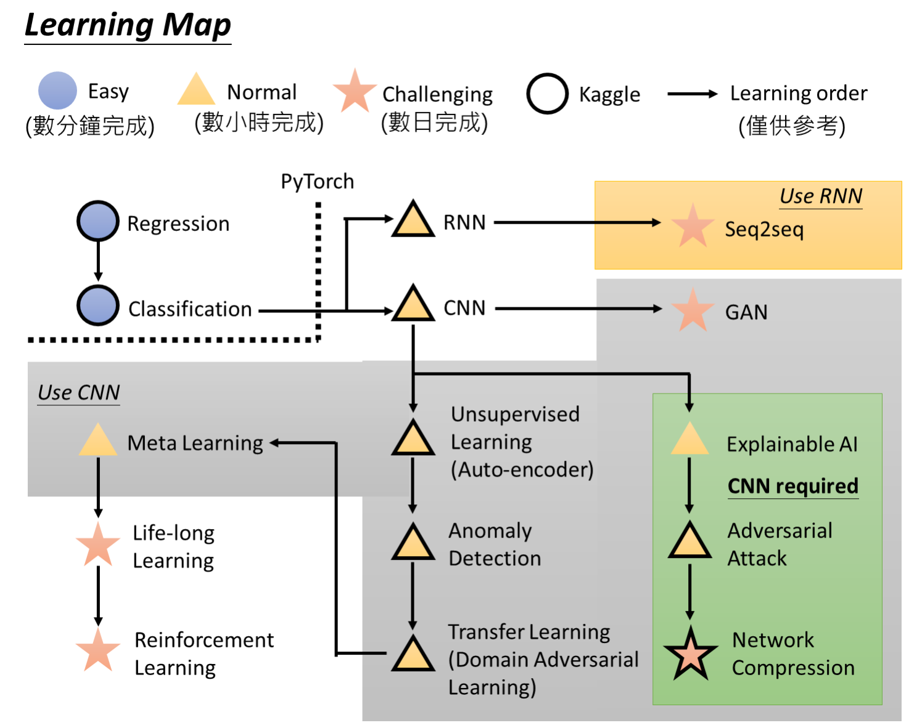

# Lee Hongyi Machine Learning Notes

Course Learning-Map

## P1-Introduction
### Environment
- Linux
- Python 3.6.8

### Supervised v.s. Reinforcement
- Supervised: 
	Given an algorithm, judge the next step.
- Reinforcement Learning:
	- No given algorithms(people cannot figure out)
	- First move-> ...many moves...-> Algorithms by machine itself.-> Win!
- *Example*: AlphaGo == Supervised + reinforcement 

### Homework1: PM2.5 Prediction
- Optimization Algorithm
    - 1: SGD→ Simplist! 
    - 2: Adagrad→ 二阶动量
        - Principle: Update the learning-rate
        $V_t = \sum_{\tau =1}^t g_{\tau}^2$
        $\eta_t = \alpha \cdot m_t/\sqrt{V_t + \epsilon}$
        $w_{t+1} = w_t - \eta_t$
        

        > $V_t$: 二阶动量：迄今为止所有gradient的平方和
        > $\eta_t:$ 计算当前时刻的下降梯度→ $\eta_t = \alpha \cdot m_t/\sqrt{V_t + \epsilon}$
        	更新weight的参数→ $w_{t+1} = w_t - \eta_t$
        > $\alpha:$ learning-rate;
        > $\epsilon:$ complement,防止Zero Division Error

